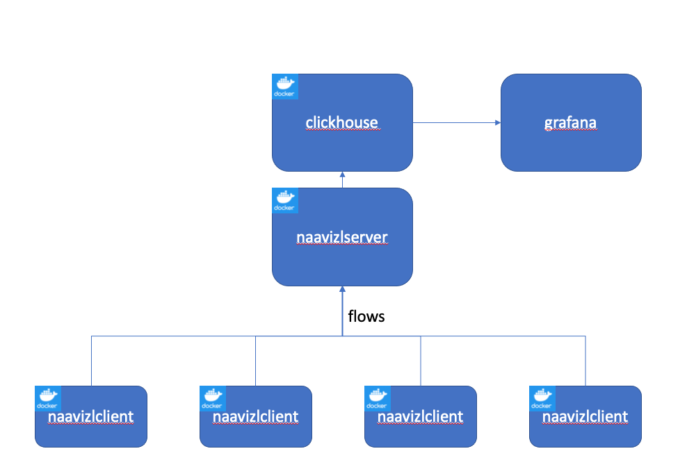

naavizl - A Network Analysis And Visualization System
====================
Summary
--------------

Naavizl is a system for collection, analysis, and visualization of network data.

Architecture
--------------

The system consists of naavizlclient images that run on the collecting network device, one or more naazvizlservers that export the network data to a Clickhouse database, and Grafana visualization system.